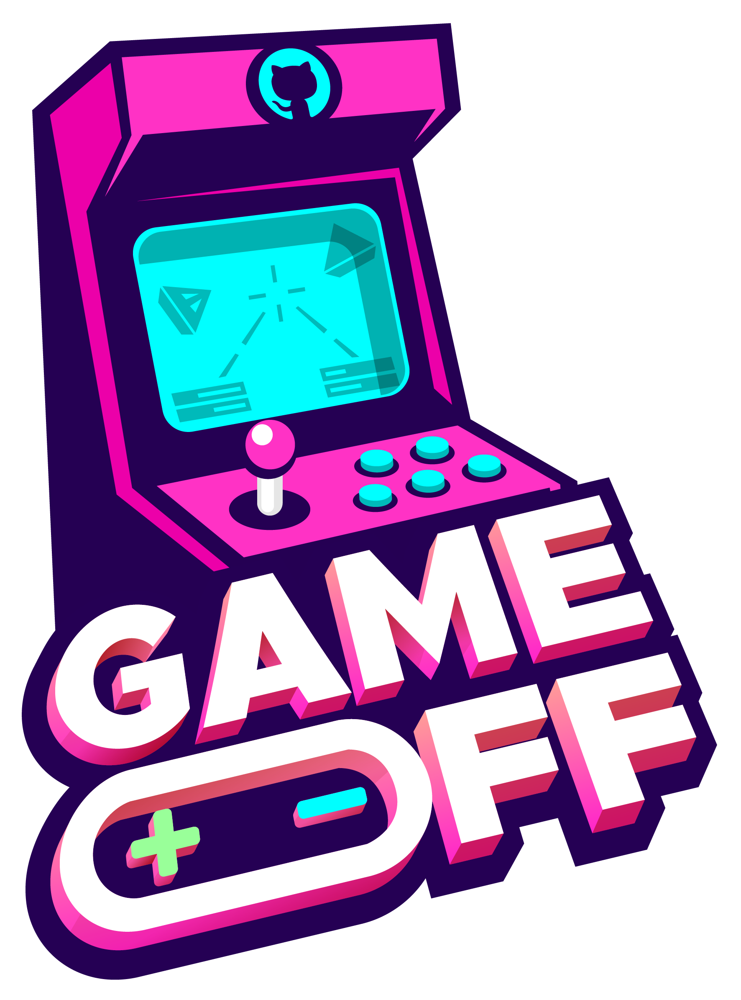

# GameOff 2023 project

A puzzle game about linking objects together.

## Controls
* **Move**: WASD or arrow keys
* **Look around**: Move mouse
* **Link objects**: Left click
* **Unlink objects**: Right click
* **Change link type**: Scroll

## Link types
There are several ways two objects can be linked:
* **Forward link**: Any movement applied to object A is also applied to object B *if possible*, and vice versa. If one object is for example pushed up against the wall, the other can still move.
* **Static forward link**: As above, but if one object is pushed up against at wall, the other cannot move in that direction.
* **Reverse link**: As the static forward link, but movement from one object is negated before being applied to the other.

## Assets
UI assets from [Wenrexia](https://opengameart.org/content/assets-ui-minimalism-scifi).
